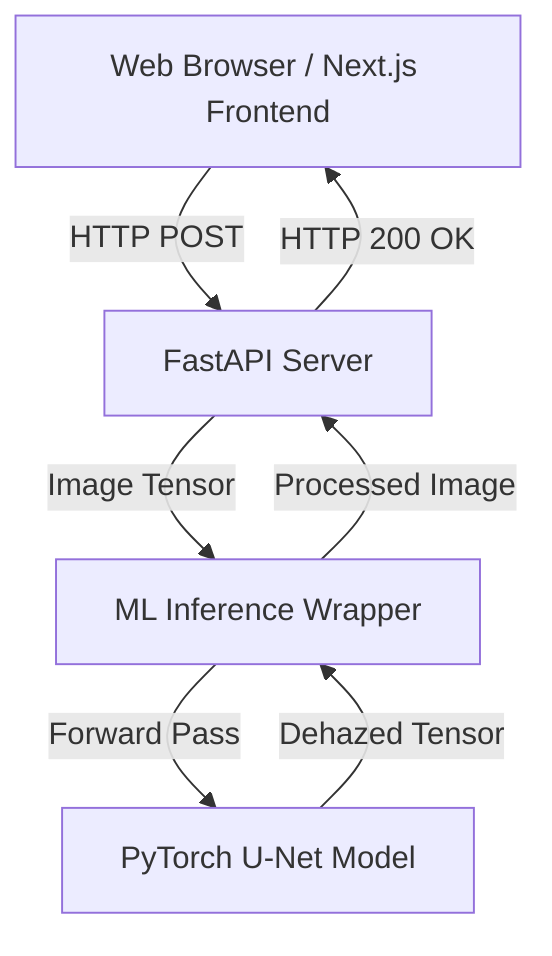

# Architecture Overview

This project was refactored from a standalone Jupyter Notebook into a robust, layered architecture adhering to Clean Architecture principles, Separation of Concerns, and Modular Design.

## High-Level System Architecture

## Folder Structure & Module Boundaries

The codebase is organized into distinct domain boundaries to enforce isolation:

- `src/ml/`: The core Machine Learning domain.
  - `models/cnn.py`: Contains the definition of the PyTorch U-Net model. Isolated from API and data concerns.
  - `data/dataset.py`: Handles raw data loading and transformations.
  - `train.py`: The orchestration script for model training (Optimizer, Loss, DataLoaders).
  - `inference.py`: The adapter pattern wrapping the raw PyTorch model, exposing a clean interface (`process_image(PIL.Image) -> PIL.Image`) for upstream services.

- `src/api/`: The Application/Service layer.
  - `main.py`: The FastAPI application. Handles HTTP routing, request validation, CORS, and dependency injection of the ML model.
  - `test_main.py`: Automated integration tests ensuring the API correctly serves predictions.

- `src/web/`: The Presentation layer.
  - A Next.js (React) application.
  - Handles client state, user interactions, aesthetics, and API communication.

## Key Architectural Decisions

1. **Adapter Pattern (Inference Wrapper)**: 
   The `Dehazer` class in `src/ml/inference.py` decouples the FastAPI application from PyTorch specifics. If we swap PyTorch for ONNX or TensorRT in the future, the API layer does not need to change.

2. **Decoupled Frontend/Backend**:
   The frontend is a dedicated Next.js App, and the backend is a separate FastAPI service. This allows independent scaling, distinct deployment pipelines, and language-specific optimizations.

3. **Asynchronous I/O**:
   FastAPI leverages `async/await` for handling file uploads, ensuring the server isn't blocked while reading incoming byte streams.
